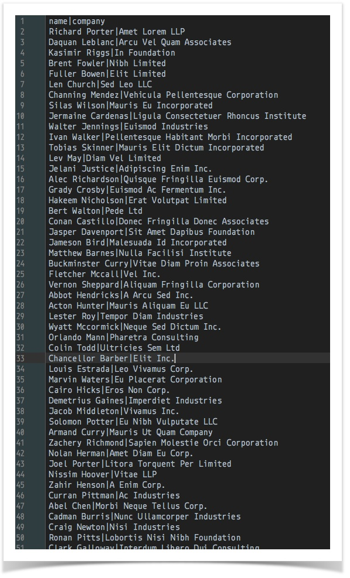
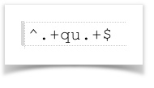
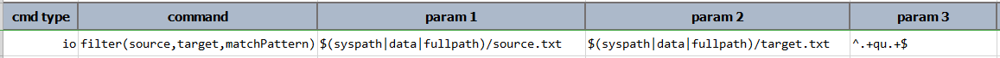
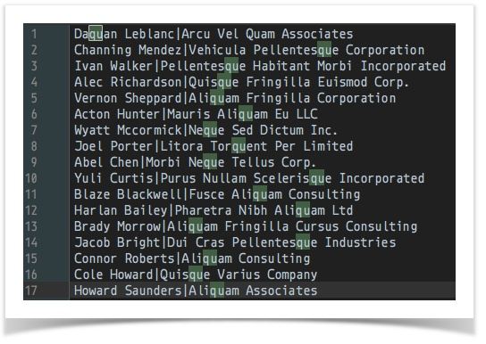

### Description
This command filters out all the lines found in `source` via the specified `matchPattern` (regular expression) and 
stores the matched lines in `target`. This can be advantageous for situation where a fairly large file contains the 
content of interest but only in small portion. Instead of scanning through such large file with return of deriving 
at a relatively fewer lines of interest (which takes time and compute resource), using this command could drastically 
cut down the processing time. As a side effect, this command will produce a file - i.e. `target` - which contains 
only the _lines_ of interest. See the Example section for more details.

### Parameters
- **source** - the file to scan for matching pattern
- **target** - the file to save all matched lines
- **matchPattern** - the pattern to match. This is regular expression, matched a line at a time

### Example
`source.txt` (shown only the first 50 lines) 

`matchPattern` (line contains `qu`) 

**Script**: 

`target.txt` (17 lines found with `qu`) 

### See Also
- [`searchAndReplace(file,config,saveAs)`](searchAndReplace(file,config,saveAs))
