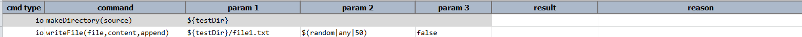
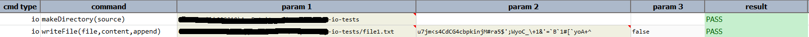

### Description
This command will create the directory on the path provided as `source`.

### Parameters
- **source:** - the location where directory is to be created

### Example
**Script**: 

**Output**: 

### See Also
- [`writeFile(file,content,append)`](writeFile(file,content,append))
- [`copyFiles(source,target)`](copyFiles(source,target))
