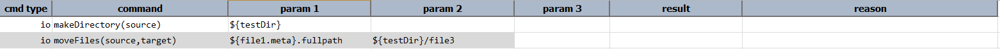
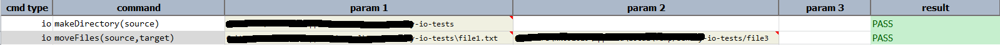

### Description
This command moves the files from one location to other. The user need to provide `source` and `destination`.



### Parameters
- **source** - the source location of the file to be moved
- **target** - the target location to move to

### Example
**Script**: 

**Output**: 

### See Also
- [`makeDirectory(source)`](makeDirectory(source))
- [`moveFilesByRegex(sourceDir,regex,target)`](moveFilesByRegex(sourceDir,regex,target))
- [`copyFiles(source,target)`](copyFiles(source,target))
- [`writeFile(file,content,append)`](writeFile(file,content,append))
- [`count(var,path,pattern)`](count(var,path,pattern))
- [`saveFileMeta(var,file)`](saveFileMeta(var,file))
