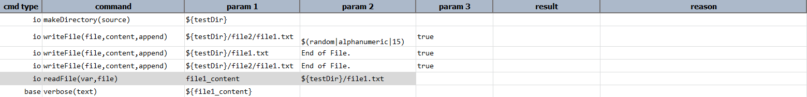
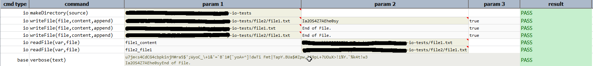

### Description
This command read the entire content of  `file` and stores into a data variable denoted by `var`.

### Parameters
- **var** - this parameter is a variable, where the content read from the file would be stored.
- **file** - this parameter is full path or location of the file from where content need to be read.

### Example
**Script**: 

**Output**: 

### See Also
- [`makeDirectory(source)`](makeDirectory(source))
- [`writeFile(file,content,append)`](writeFile(file,content,append))
- [`copyFiles(source,target)`](copyFiles(source,target))
