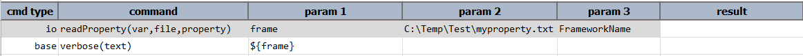
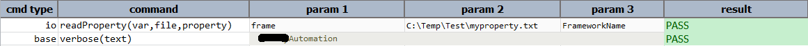

### Description
This command will read `file` and search for a name-value pair where the name is specified as `property`, and store the
value in a data variable denoted as `var.
    

### Parameters
- **var** - the variable name to store the property value found by the command
- **file** - the full path and name of the file from where the property value is to be retrieved
- **property** - the property name whose value is to be retrieved

### Example
**Script**: 

**Output**: 

### See Also
- [`deleteFiles(location,recursive)`](deleteFiles(location,recursive))
- [`moveFiles(source,target)`](moveFiles(source,target))
- [`copyFiles(source,target)`](copyFiles(source,target))
- [`makeDirectory(source)`](makeDirectory(source))
- [`readFile(var,file)`](readFile(var,file))
- [`saveFileMeta(var,file)`](saveFileMeta(var,file))
