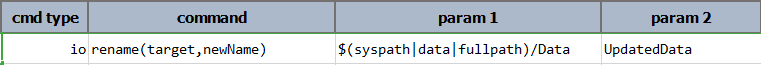

### Description
This command rename an existing file or directory to a different name (denoted by `newName`). This command will
fail if:
1. The existing file or directory (`target`) does not exists or is inaccessible. 
2. The new file or directory already exists.
3. The specified new name (`newName`) is not a valid file or directory name. For example, it is unacceptable to have a 
   file in Windows named as `Hello:World`.
   
In addition, and especially in Windows, this command will likely fail if the targeted directory is currently open in 
command console, or a file within such directory is currently opened by another program (such as Excel or Word).

### Parameters
- **target** - the fully qualified file or directory to rename.
- **newName** - the new name for the specified file or directory name. Do not use `\` or `/` to simulate a file or 
  directory move. Use the [`moveFiles(source,target)`](moveFiles(source,target)) command instead.

### Example
**Script**: 

**Output**: 

After execution, folder name `Data` is changed to `UpdatedData`. 

### See Also
- [`copyFiles(source,target)`](copyFiles(source,target))
- [`moveFiles(source,target)`](moveFiles(source,target))
