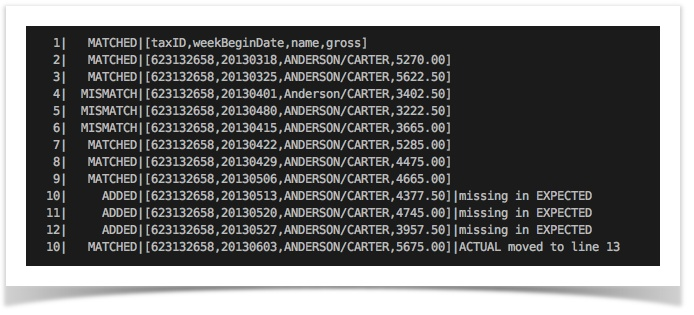
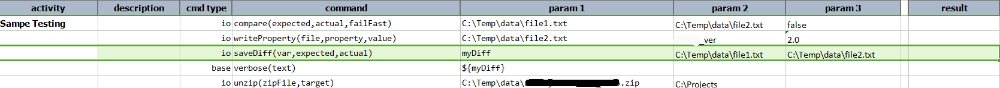
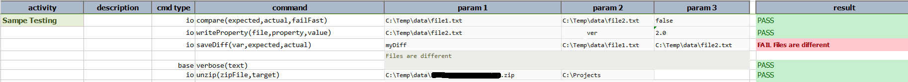

### Description
This command compares the content represented by `expected` and `actual` and store the differences into a variable 
specified via `var`. Internally, this command applies the same algorithm as 
[io &raquo; `compare(expected,actual,failFast)`](compare(expected,actual,failFast)). The differences between 
`expected` and `actual` are stored as text - represented by a variable specified as `var`. Below is an example of 
such text:

The general format of the _diff_ is: 
`line number | match result | \[ line content \] | additional details`

### Parameters
- **var** - this parameter will stored the different values of the files.
- **expected** - this parameter is the expected file.
- **actual** - this parameter is the actual file.

### Example
**Script**: 

**Output**: 

### See Also
- [`compare(expected,actual,failFast)`](compare(expected,actual,failFast))