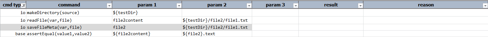
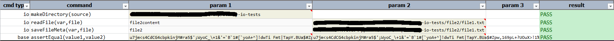

### Description
This command will save the meta data of the `file` as `var`. One can then query this `var` to further the desired 
automation. The metadata information available are listed below. One would access them via the 
`${var}.meta_data_name` syntax. For example, `${var}.[size]` will retrieve the byte size of the target 
`file`.

If the specified `file` does not exist, Nexial will FAIL the corresponding step.

#### Available Metadata
- `[fullpath]` - the fully qualified path information of a file.
- `[name]` - the file name of a file.
- `[lastmod]` - the last modified (last updated) timestamp, in <a href="https://en.wikipedia.org/wiki/Unix_time" 
  class="external-link" target="_nexial_external">epoch</a>, of a file.
- `[size]` - the byte size of a file. 
- `[isDir]` - `true` if the `file` in question is in fact a directory; `false` otherwise.
- `[isReadable]` - `true` if the `file` in question is readable by the run-user that executes this Nexial automation.
- `[isWritable]` - `true` if the `file` in question is writable by the run-user that executes this Nexial automation.
- `[isExecutable]` - `true` if the `file` in question is executable by the run-user that executes this Nexial 
  automation. Note that in some Windows OS, readable is equivalent as executable.
- `[perm]` - a series of 3 boolean values to represent "readable", "writable" and "executable" of a file.
- `[bytes]` - the file size.
- `[text]` - the raw content of a file as text.

### Parameters
- **var** - this parameter is used to store the data of the file into this variable
- **file** - this parameter is location of the file and filename from where the data needs to be read

### Example
**Script**: 

**Output**: 

### See Also
- [`readFile(var,file)`](readFile(var,file))
- [`count(var,path,pattern)`](count(var,path,pattern))
- [`writeFile(file,content,append)`](writeFile(file,content,append))
- [`copyFiles(source,target)`](copyFiles(source,target))
