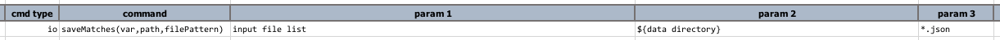
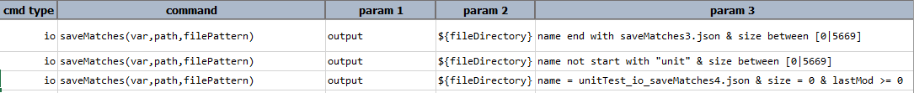

**This command was previously `saveMatches(var,path,filePattern)`.**

### Description
This command search through a directory denoted by `path` for files that matches the specified `fileFilter` and (optional) 
the specified `textFilter`, and save the list of such files as an array (list) to the variable `var`. The main goal of
this command is to automate the collection of files from a given location (`path`) that match one or more of the 
following:
- file name (use `name match ...` in `fileFilter`)
- file size (use `size > ...` or `size < ...` in `fileFilter`)
- file's last modified date (use `lastmod > ...` or `lastmod < ...` in `fileFilter`)
- file's content (use `textFilter`; supports regular expression)

This command will automatically recurse into the subdirectories of `path`, if any.
  
The `fileFilter` parameter can be:
1. The exact file name such as `MyDocument.txt`
2. The conventional wildcard file pattern such as `*.log` or `a*.json`
3. The more powerful name matching approach using regular expression, which is prefixed with `REGEX:`
   - e.g. `REGEX:a.{2,5}\-\d{4}.txt`
4. The file size (in bytes) filtering such as `size > 1024`
5. The last modified date of a file - `lastMod >= 39483294793`. This matches the last modified date/time of a file as 
   timestamp (i.e. epoch).

Additionally, `fileFilter` may be expressed as [Nexial Filter](../../flowcontrols/filter) to create a multi-criteria
filter on `name`, `size` and/or `lastMod`. For example,

    name end with saveMatches4.json & size = 0 & lastMod >= 1547394418

...means "match on files where 
    - the file name ends with `saveMatches4.json`, 
    - has no byte (i.e. empty file) and 
    - was last modified since January 13, 2019 3:46:58 PM"

**Note**: In order to distinguish between "exact match" and "filter match", please observe the following rules:
> **The "filter match" is expected to contain space(s) between the keywords (like `name`, `size`, and `lastMod`)** 
> **and the corresponding criteria.** 

For example, `name = saveMatches4.json` will return the file with name `saveMatches4.json`. But`name=saveMatches4.json` 
will return the file with name `name=saveMatches4.json`

In addition to file name, size and last-modification filter, this command also support content filtering (`textFilter`). 
This parameter is optional and may be omitted. When used in combination with `fileFilter` this can be a powerful way
to filtering files. `textFilter` supports regular expression as well. At this time, this command supports content filtering
on all text-based files, PDF and XLSX. For both PDF and XLSX files, Nexial will extract text for content filtering 
automatically. 

Note that:
1. This command WILL automatically scan the specified path recursively.
2. Special care has been given to MS Office documents so that the working documents (such as `~myFile.xlsx`) will be 
   ignored.

### Parameters
- **var** - the variable to store the matches
- **path** - the target path to be searched.  Note that this command does not search recursively
- **fileFilter** - the file pattern to match. See above for further details
- **textFilter** - (optional) the content (text) pattern to match. See above for further details

### Example
**Script**: 
 

**Script**: 

