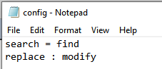
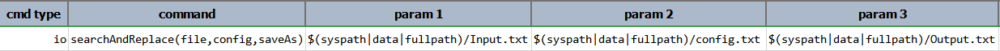

### Description
This command performs search-and-replace routine on the content of `file` via the name/value pairs found in `config`. 
The `name` will be the search string, and `value` the replacement string. The search-and-replace routine is performed 
upon the entire `file` content. When the said routine is complete, the resulting content will be saved to a file as 
specified via `saveAs`. It is possible that `saveAs` may be the same as `file`, which will in turn saved the modified 
content back to the same file.

Notes:
- Each name/value pairs will be scanned for data variable substitution (i.e. `${...}`) before performing the 
  search-and-replace routine. In order to circumvent the `${...}` substitution - e.g. perhaps one desires to search 
  for `${data}` with `data` - one can escape the `${...}` syntax. For example, use `\$\{data\}` instead. 
- The standard 
  <a href="https://docs.oracle.com/cd/E23095_01/Platform.93/ATGProgGuide/html/s0204propertiesfileformat01.html" 
  class="external-link" target="nexial_link">Properties File Format</a> uses either `=` or `:` as separator between
  corresponding name/value pair. However, Nexial will only consider the first `=` or `:` as separator, with any 
  additional `=` or `:` as part of value.
- Escape `=` with `\=` and `:` with `\:` to avoid the wrong `=` or `:` being parsed as separator.

### Parameters
- **file** - the full path of the file upon which the search-and replace routine will be performed.
- **config** - the full path of properties file (name/value pair) to use for the search-and-replace routine.
- **saveAs** - the full path of the file to save the resulting content.

### Example
**Input.txt**: 

**config.txt**: 
This is the configuration for the search-and-replace routine. 

**Script**: 

**Output File : Output.txt** 
The words `search` and `replace` in `Input.txt` are replaced by `find` and `modify` respectively.

### See Also
- [`filter(source,target,matchPattern)`](filter(source,target,matchPattern))