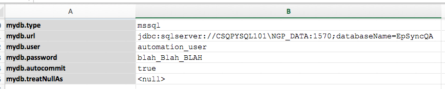
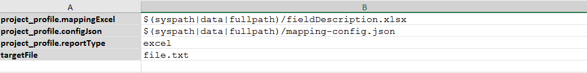
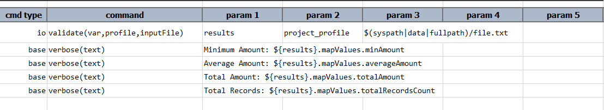
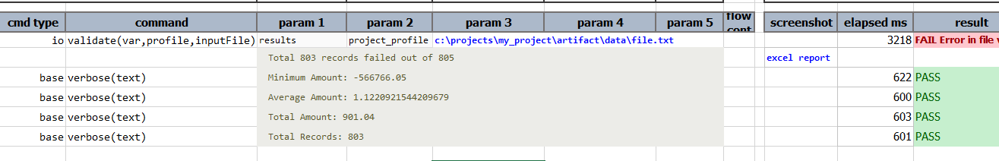
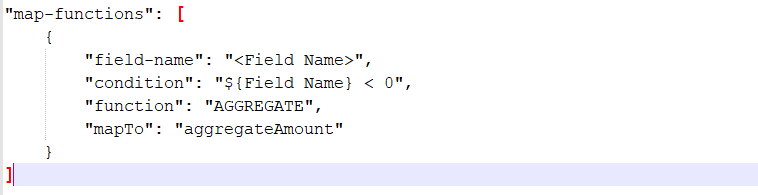

### Description
This command validates any text file with the fields in each record (line) either as a 
'**Fixed Length Fields'** type or **'Delimiter Separated Fields**' type.

Various validations can be carried out as configured. The configurations includes, self description 
of each field and the validations to be carried out.

#### Validation Types supported
Each field value in the record will go through basic validations:
1. Data Type
   * `Numeric` - only numeric characters
   * `Alphanumeric` - only alphabetic and numeric characters.
   * `Alpha` - only alphabetic characters.
   * `Alpha Upper` - alphabetic characters in upper case.
   * `Alpha Lower` - alphabetic characters in lower case.
   * `Blank` - blank
   * `Person Name`
      * common data type for `First Name` and `Last Name`.
      * accepts at least one or more characters and can be combined with a `space`, `comma`, `dot`, `hyphen` or `apostrophe`.
      * you can also use `First Name` for **First Name** and `Last Name` for **Last Name** to be more specific.
   * `Regex` - syntax `REGEX:<pattern>`
   * `Any` - any <a href="https://en.wikipedia.org/wiki/ASCII#Printable_characters" class="external-link" target="_nexial_link">ASCII printable characters</a>
2. Text Alignment
   * `Left`
   * `Right`
 
Other validations needs to be configured for each field of the record:
1. `REGEX` - Regular expression to check against actual field value 
2. `EQUALS` - Equals to check against actual field value 
3. `IN` - IN to check the presence of actual field value against a list of expected values
4. `DATE` - to do date field validation against given date pattern. See below for the date pattern syntax. 
5. `SQL` - to check field value against a database query

Validations in progress (not yet implemented):
1. `API`
2. `RANGE`

Example of a `SQL` validation:
```json
"validations": [
    {
        "field-name": "<FIELD_NAME>",
        "validation-methods": [
            {
                "type": "SQL",
                "params": [
                    "mydb",
                    "SELECT …  ${…} … "
                ]
            }
        ]
    }
]
```

The above example performs a SQL-based validation on the field marked as `<FIELD_NAME>`. The first parameter `mydb` 
refers to the database connection profile for executing the specified SQL (the second parameter). Below is an 
example of a database connection profile set up in a data file:<br/>



The SQL statement is expected as a SELECT statement which will return 1 or more rows as indication as a positive 
validation. No rows returned means that the desired validation has failed. It is possible to include other field values
or data variables as part of the validation SQL statement. Use the standard `${...}` syntax to construct a dynamic SQL
statement. 


#### Map Functions supported
Map Functions are to apply below functions on all the records on a field and get the value. Which could be later used 
to validate against any another field in any record. 
1. `COUNT` - count to calculate the total count of the fields present
2. `MIN` - to calculate the MIN amount
3. `MAX` - to calculate the MAX amount
4. `AGGREGATE` - to calculate the aggregate amount
5. `AVERAGE` - to calculate the average amount


### Parameters
- **var** - variable name to store the results
- **profile** - profile name that has to be defined in data file **(see below example)**
- **inputFile** - input file path that is to be validated


### Example
In the below example, the data file is defined with the variables with profile name. In this case, the profile name 
is **project_profile**.

**Explanation**:

**Data file:**<br/>


- **project_profile.mappingExcel**: It is the excel file where the description of each field is defined.
- **project_profile.configJson**: It is the configuration file in JSON format to define the validations to be 
  executed
- **project_profile.reportType**: It is the report type to be mentioned to generate the reports

**Script**:<br/>


**Output**:<br/>
The output file
- Displays the total number of records processed with failed count
- Also provides a link to open the generated report file. The generated excel report file will have all the details, 
  that consists of 'Summary' sheet and 'Error_Report' sheet.



Map Function Format to use condition:



Date format pattern letters and their meaning:<br/>
- G - Era designator (AD)
- y - Year (1996; 96)
- Y - Week Year (2009; 09)
- M - Month in year (July; Jul; 07)
- w - Week in year (27)
- W - Week in month (2)
- D - Day in year (189)
- d - Day in month (10)
- F - Day of week in month (2)
- E - Day name in week (Tuesday; Tue)
- u - Day number of week (1 = Monday, ..., 7 = Sunday)
- a - AM/PM marker
- H - Hour in day (0-23)
- k - Hour in day (1-24)
- K - Hour in am/pm (0-11)
- h - Hour in am/pm (1-12)
- m - Minute in hour (30)
- s - Second in minute (55)
- S - Millisecond (978)
- z - General time zone (Pacific Standard Time; PST; GMT-08:00)
- Z - RFC 822 time zone (-0800)
- X - ISO 8601 time zone (-08; -0800; -08:00)


### Downloads
- [Excel Descriptor Template](excel-mapping-config-template.json): the config template file for 'Excel' specification.
- [JSON Config Template](json-mapping-config-template.json): the config template for "JSON' specification.

