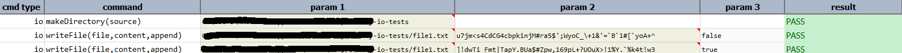

### Description
Like [`writeFileAsIs(file,content,append)`](writeFileAsIs(file,content,append)), this command writes `content` to `file`, 
with an optional flag to `append` to existing content. However, this command will also perform data variable 
substitution during the file-write operation. This means that if `content` contains any `${...}`, 
`[(EXPRESSION) => ...]`. `$(...)` text, such text will be replaced with the value known during the execution. 
The [`writeFileAsIs(file,content,append)`](writeFileAsIs(file,content,append)), on the other hand, will not perform
data variable substitution during its file-write operation.

The `content` parameter may be a fully qualified file path, a http/https web resource, or text content. Nexial will 
resolve the content reference internally. Use the `append` parameter to either overwrite (if `file` exists) or append 
content.



### Parameters
- **file** - this parameter if the full path of the file along with file name to which the content has to be written.
- **content** - this parameter is the content which need to written to the file
- **append** - this parameter is a boolean value if you want to append the existing value or ignore it.

### Example
**Script**: 

**Output**: 

### See Also
- [`writeFileAsIs(file,content,append)`](writeFileAsIs(file,content,append))
- [`writeProperty(file,property,value)`](writeProperty(file,property,value))
- [`$(file|append)`](../../functions/$(file))
- [`$(file|overwrite)`](../../functions/$(file))
