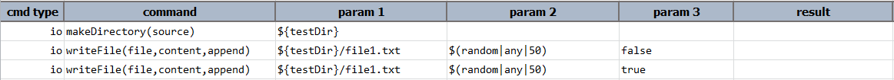

### Description
- This command is to the update the value of the file.
- In other words if there is any property with key and value and the value need to be updated, then this command can 
  be used.
- The command will update the property of the file and pass or else fail otherwise.

### Parameters
- **file** - this parameter is the file with location to be updated.
- **property** - this parameter is the key of the property.
- **value** - this parameter is the value to be updated or replaced for the key.

### Example
**Script**: 

**Output**: 

### See Also
- [`compare(expected,actual,failFast)`](compare(expected,actual,failFast))
- [`saveDiff(var,expected,actual)`](saveDiff(var,expected,actual))
- [`unzip(zipFile,target)`](unzip(zipFile,target))
