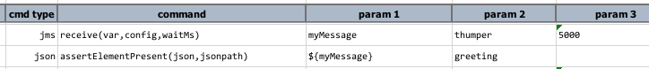

### Description
This command automates the operation of receiving the next-available message on the target JMS destination.  
The variable `var` is used to stored the retrieved message, `config` refers to the setting detailed in
[Connection Configuration](index.html#connection-configuration), and `waitMs` is the number of milliseconds to wait 
before giving up on "receive" operation.  Use `-1` or `(empty)`as `waitMs` to wait without timeout.  If timeout is 
reached, and message is received, then `var` will be removed from current execution.

**Note:**
1.  All JMS connections are configured for `AUTO_ACKNOWLEDGE` to simplify automation.
2.  Only `TEXT` or `MAP` message types are currently supported.

### Parameters
- **var** - the variable to hold the received message
- **config** - the configuration specified for the target message destination
- **waitMs** - the number of milliseconds to wait before giving up on receiving message from the target message 
  destination.  Use `-1` or `empty` to signify willing to wait _forever_.

### Example
