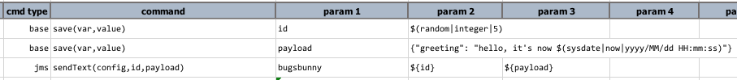

### Description
This command automates the operation of sending a message on the target JMS destination.  `config` is used to 
reference the settings detailed in [Connection Configuration](index.html#connection-configuration), and 
`messageId` is the unique message ID (aka `JMSMessageID`) for the intended message.  The `payload` is the content of 
the message to send, which can be `TEXT`or `MAP`.  It can represent a more complex message structure such as JSON or 
XML.

**Note:**
1.  All JMS connections are configured for `AUTO_ACKNOWLEDGE` to simplify automation.
2.  Only `TEXT` or `MAP` message types are currently supported.
3.  All messages are sent as `NON_PERSISTENT`.  This means that if the target JMS server should go down or restart 
    after the message is sent, such message will be wiped out and not be available after the same JMS server is back 
    online.

### Parameters
- **config** - the configuration specified for the target message destination
- **messageId** - an unique ID for the intended message.  In most cases, using the 
  [$(random|integer)](../../functions/$(random)) built-in command or timestamp should suffice.
- **payload** - the message content to sent.

### Example

