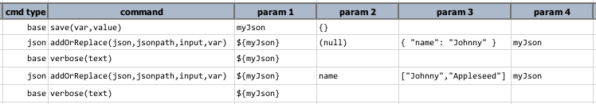
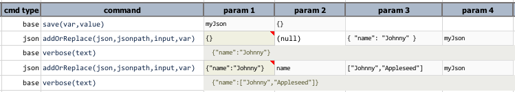

### Description
This command adds or replaces a portion of a JSON document (denoted by `json`) with either another JSON document or 
array (denoted by `input`). One can use `jsonpath` to specify the position or node of the JSON document to 
be replaced or added. The final outcome (should still be JSON) would be saved to `var`.

Flexibility is built into this command so that one can use it to add new JSON fragment (document) or JSON array, append 
to existing JSON fragment (document) or array, or replacing existing JSON fragment (document) or array. A good 
understanding of how this command works would give one the power to automate JSON document manipulation efficiently.

#### Limitations
- At this time, this command **does not** support deletion of JSON elements.
- At this time, this command **does not** support value-matching or regex-based filtering such as 
  `country.state[name=California].city[name=REGEX:San.+]`.

Both limitations will be addressed in the future.

#### Rules


### Parameters
- **json** - the JSON content or JSON file to validate for correctness
- **jsonpath** - the [jsonpath](../../jsonpath) to reference a node or array of `json`
- **input** - the JSON to add or replace
- **var** - the variable to save the resultant JSON document.

### Example
Script: 

 

Output: 

 

For more examples, see [above](#rules).
