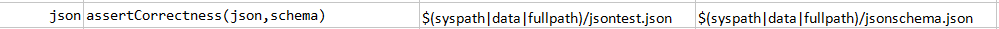
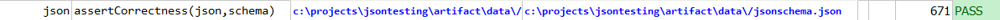

### Description
This command asserts the correctness of the json file against the specific schema defined.

### Parameters
- **json** - the JSON content or JSON file to validate for correctness
- **schema** - json schema file for document correctness validation

### Example
**Script**: 

**Output**: 

