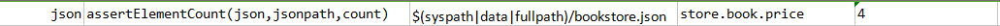

### Description
This command asserts the number of elements in `json` that match the specified `jsonpath`.

### Parameters
- **json** - the JSON content or JSON file to validate for correctness
- **jsonpath** - the jsonpath to reference JSON element of interest (Refer below example for syntax usage)
- **count** - the expected count

### Example
**Book Store Data in JSON** 

Use dot (.) notation to navigate to the child element. See the below example for syntax usage:

**Script**: 

**Output**: 

