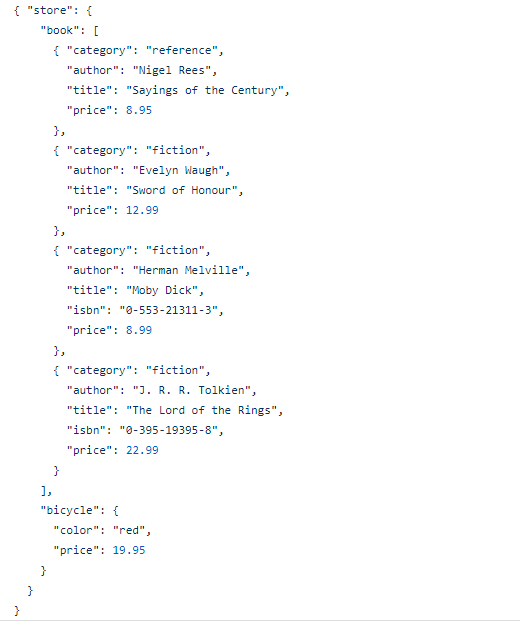
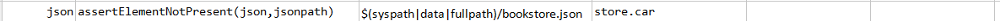

### Description
This command asserts the given JSON element as described via `jsonpath` is not present in `json`.

### Parameters
- **json** - JSON content or file
- **jsopath** - the path to the JSON element in question

### Example
**Book Store Data in JSON** 

**Script**: 

**Output**: 

