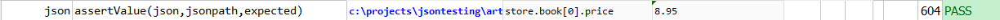

### Description
This command asserts that `jsonpath` points to an element (or the first element) in `json` whose value match that of
`expected`.

### Parameters
- **json** - the JSON document or file
- **jsonpath** - the path to describe the JSON element (or the first element) in question
- **expected** - expected value of the matching JSON element

### Example
**Book Store Data in JSON** 

**Script**: 

**Output**: 

