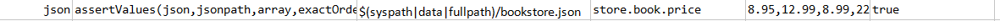
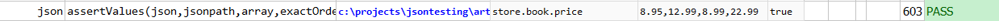

### Description
This command asserts that `jsonpath` resolves to a list of JSON elementin `json`, whose values matches that of `array` 
in totality.  Use `exactOrder` to indicate if exact order is expected.

### Parameters
- **json** - the JSON document or file
- **jsonpath** - the path to describe the JSON element (or the first element) in question
- **expected** - expected list of values of the matching JSON element
- **exactOrder** - `true` if the lists match in exact order

### Example
**Book Store Data in JSON** 

**Script**: 

**Output**: 

