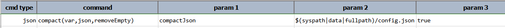

### Description
This command parse `json` and remove all null or empty (i.e. empty string) elements from it. The compacted `json` is 
then stored to a data variable denoted as `var`. The last parameter `removeEmpty` allows one the option to remove any
node with only empty text (like `{ "name": "" }`). Set it to `true` to do so.

Note that this command *also* minify the JSON, as a way to further "compact" it.

For example, suppose we have the following JSON document named `config.json`:
```json
{
  "config": {
    "location1": [
      { "code": "CA", "state": "California" }
    ],
    "location2": { },
    "config1": {
      "client": 12345,
      "active": true
    },
    "config": [],
    "dataListing": ["", "", null, "", { } ]
  }
}
```

Using this command with `removeEmpty` set to `false` (default), the resulting JSON would become (left _un-minified_ to 
better visualization):
```json
{
  "config": {
    "location1": [
      { "code": "CA", "state": "California" }
    ],
    "config1": {
      "client": 12345,
      "active": true
    },
    "dataListing": ["", "", ""]
  }
}
```

(Note that in actuality Nexial [`minify(json,var)`](minify(json,var)) the above JSON.)

Observe that the `location2` and `config` nodes have been removed. These nodes do not have any content hence were 
compacted away. The node `dataListing` was an array with some empty text, a null and a empty node. Since `removeEmpty`
was set to `false`, only the null and empty nodes were removed - leaving 3 empty text element in the array.

Suppose we use this command with `removeEmpty` set to `true`, then the resulting JSON would look like:
```json
{
  "config": {
    "location1": [
      { "code": "CA", "state": "California" }
    ],
    "config1": {
      "client": 12345,
      "active": true
    }
  }
}
```

The node `dataListing`, after its empty text, null and empty node were removed, has become an empty array node. As such,
it is also compacted away (removed).


### Parameters
- **var** - the variable name to store the compacted content.
- **json** - the JSON document or file
- **removeEmpty** - `true` is empty text should also be considered for compaction.


### Example
**Script**:<br/>



### See Also
- [`beautify(json,var)`](beautify(json,var))
- [`minify(json,var)`](minify(json,var))
