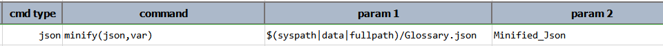

### Description
This command parse `json` into a minified version of the same, and stored the compressed content as `var`. Logically and
structurally speaking the content of `var` should be the same as that of `json`.

For example, suppose the following JSON document named `Glossary.json` (excerpt from 
<a href="https://json.org/example.html" class="external-link" target="nexial_link">https://json.org/example.html</a>):
```json
{
  "glossary": {
    "title": "example glossary",
    "GlossDiv": {
      "title": "S",
      "GlossList": {
        "GlossEntry": {
          "ID": "SGML",
          "SortAs": "SGML",
          "GlossTerm": "Standard Generalized Markup Language",
          "Acronym": "SGML",
          "Abbrev": "ISO 8879:1986",
          "GlossDef": {
            "para": "A meta-markup language, used to create markup languages such as DocBook.",
            "GlossSeeAlso": [
              "GML",
              "XML"
            ]
          },
          "GlossSee": "markup"
        }
      }
    }
  }
}
```

This command will compressed all the empty spaces and line separators:
```json
{"glossary":{"title":"example glossary","GlossDiv":{"title":"S","GlossList":{"GlossEntry":{"ID":"SGML","SortAs":"SGML","GlossTerm":"Standard Generalized Markup Language","Acronym":"SGML","Abbrev":"ISO 8879:1986","GlossDef":{"para":"A meta-markup language, used to create markup languages such as DocBook.","GlossSeeAlso":["GML","XML"]},"GlossSee":"markup"}}}}}
```


### Parameters
- **json** - the JSON document or file
- **var** - the variable name to store the compressed content.


### Example
**Script**:<br/>



### See Also
- [`beautify(json,var)`](beautify(json,var))
- [`compact(var,json,removeEmpty)`](compact(var,json,removeEmpty))
