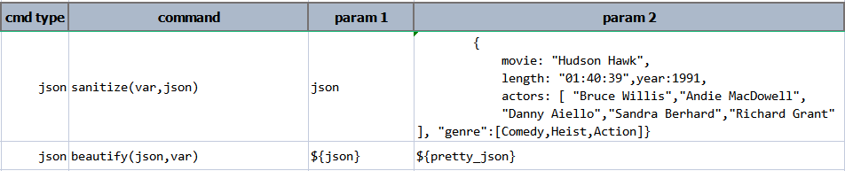

### Description
This command sanitize `json` so that it may be safely used as compliant JSON document. The parameter `json` can be 
text, a file or an URL. Consider the following example snippet to describe the move "Hudson Hawk":
```
        {
            movie: "Hudson Hawk",
            length: "01:40:39",year:1991,
            actors: [ "Bruce Willis","Andie MacDowell",
            "Danny Aiello","Sandra Berhard","Richard Grant" 
], "genre":[Comedy,Heist,Action]}
```

It should be obvious that not only is the above snippet not format for readability, it is in fact not a syntactically 
correct JSON document. Most notablee error would be the missing double quotes around some of the keys and values.

Instead of spending time manually inspecting and fixing such ill-formed document, one may use this command to achieve 
the same:



After executing the above commands, the above snippet now looks _pretty and proper_:
```json
{
  "movie": "Hudson Hawk",
  "length": "01:40:39",
  "year": 1991,
  "actors": [
    "Bruce Willis",
    "Andie MacDowell",
    "Danny Aiello",
    "Sandra Berhard",
    "Richard Grant"
  ],
  "genre": [
    "Comedy",
    "Heist",
    "Action"
  ]
}
```

One may use this command to sanitize both JSON document and JSON array. Note that in the context of array, each unquote 
text instance will be considered as an individual item. For example,
```
[ color me mine ]
```

... will be sanitized as:
```json
[ "color", "me", "mine" ]
```

This command is useful to perform syntax validation and autofix (where possible). After sanitization, the result JSON 
document is considered syntactically valid and safe for use. 


### Parameters
- **var** - the variable name to store the sanitized content.
- **json** - the JSON document to sanitize; can be a file or URL.


### Example
See above

### See Also
- [`beautify(json,var)`](beautify(json,var))
