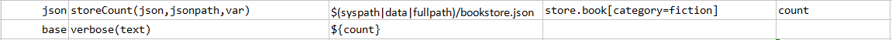
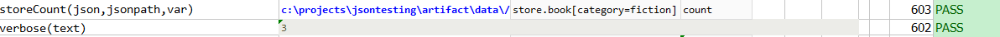

### Description
This command stores the number of elements in `json` that match the specified `jsonpath` in `var`.

### Parameters
- **json** - the JSON document or file
- **jsonpath** - the path to describe the JSON element (or the first element) in question
- **var** - the variable name to store matching count

### Example
Finds the number of books with category type as fiction, in the store 

**Book Store Data in JSON** 

**Script**: 
See the usage of the dot notation with condition to filter the books with category equals to fiction 

**Output**: 
Total 3 books of type fiction. 

