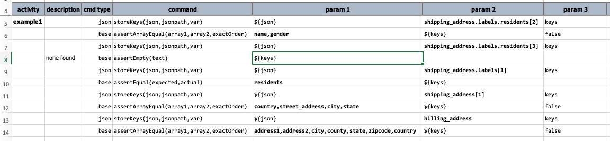

### Description
Extract the immediate keys of the resolved JSON object matching the specified [`jsonpath`](../jsonpath) and store it 
to `var`. This command reduces the current JSON document to its fragment that match the specified 
[`jsonpath`](../jsonpath). Then if the resolved JSON fragment is a valid JSON object, it extracts a list of the 
immediate keys (meaning current level only) of such JSON fragment. If the specified [`jsonpath`](../jsonpath) does not 
resolve to a JSON object (such as JSON array or single value), then an empty list to saved to `var` instead. 


This command stores the value of the matching element (or the first matching element) in `json` in `var`.  The matching
criteria is described in `jsonpath`.


### Parameters
- **json** - the JSON document or file
- **jsonpath** - the path to describe the JSON element (or the first element) in question
- **var** - the variable name to store the resolved immediate keys


### Example
For example, suppose we have the following JSON document assigned to a data variable named `json`:

```json
{
  "shipping_address": [
    {
      "street_address": "1600 Pennsylvania Avenue NW",
      "city": "Washington",
      "state": "DC",
      "labels": [
        "east coast",
        {
          "residents": [
            { "name": "Mr. President", "gender": "M" },
            { "name": "Mrs. President", "gender": "F" },
            { "name": "First Dog", "gender": "F" },
            null
          ]
        },
        null,
        "gated"
      ]
    },
    {
      "country": "USA",
      "street_address": "1733 Washington Avenue",
      "city": "Glenoak",
      "state": "CA"
    }
  ],
  "billing_address": {
    "address1": "1st Street SE",
    "address2": null,
    "city": "Seeti",
    "county": "Abrehiban",
    "state": "DC",
    "zipcode": "10541",
    "country": "USA"
  },
  "tags": [ "electronics", "hi-tech", "android" ]
}
```

Here are some ways we can extract keys from this JSON document:



### See Also
- [JSON &raquo; `keys(jsonpath)`](../../expressions/JSONexpression#keysjsonpath)

