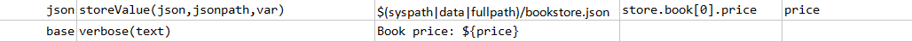
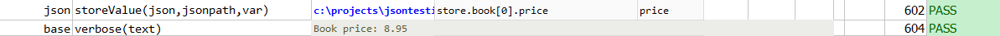

### Description
This command stores the value of the matching element (or the first matching element) in `json` in `var`.  The matching
criteria is described in `jsonpath`.

### Parameters
- **json** - the JSON document or file
- **jsonpath** - the path to describe the JSON element (or the first element) in question
- **var** - the variable name to store the matching value (or the first matching one)

### Example
**Book Store Data in JSON** 

**Script**: 

**Output**: 

