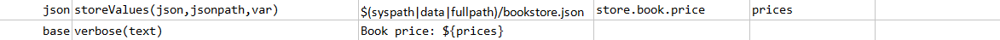
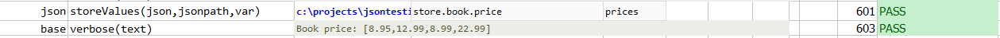

### Description
This command stores the list of value of elements in `json` that matches `jsonpath` to `var`.

### Parameters
- **json** - the JSON document or file
- **jsonpath** - the path to describe the JSON element (or the first element) in question
- **var** - the variable name to store the list of matched values  

### Example
**Book Store Data in JSON** 

**Script**: 
In the below example, finds the values of prices of all the books in the store: 

**Output**: 

