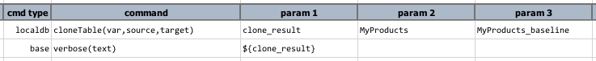
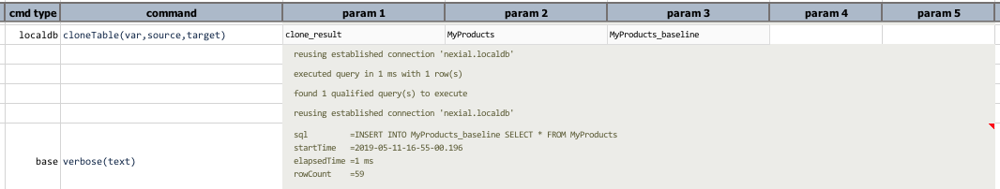

### Description
This command instructs Nexial to clone an existing table (`source`) to another table (`target`), both structure and 
data. Since SQLite uses dynamic data typing, the destination table might be slightly different in terms of data type but
both should function the same and yield the same query result.

Internally, Nexial runs several SQL statements to accomplish the cloning. The `var` parameter will be the name of the
data variable that stores the result of thse SQL statements. Usually it's not necessary to further process the result
(`var`). But this might be helpful for troubleshoot or reporting purposes.

Note that at this time, Nexial **will not** clone the underlying table relationship and constraints. Nexial will not 
propagate the cloning to the associated tables (such as child tables). If one must retain all referential integrity, 
then additional DDL execution will be needed (see [`runSQLs(var,sqls)`](runSQLs(var,sqls))). If ERD-intact cloning is 
important to you, please kindly file a 
<a href="https://github.com/nexiality/nexial-core/issues/new?template=feature_request.md" class="external-link" target="_nexial_link">Feature Request</a>.

### Parameters
- **var** - the data variable to store the outcome of the cloning.
- **source** - the source table to clone from. If this table does not exists, the corresponding step will FAIL.
- **target** - the target table to clone to. If this table already exists, the corresponding step will FAIL. 

### Example
**Script**: 

**Output**: 

### See Also
- [`cloneTable(var,source,target)`](cloneTable(var,source,target))
- [`dropTables(var,tables)`](dropTables(var,tables))
- [`exportCSV(sql,output)`](exportCSV(sql,output))
- [localdb commands](index#available-commands)
