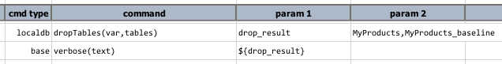
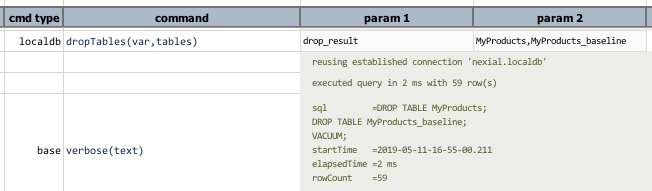

### Description
This command instructs Nexial to drop (delete) one or more `tables` in the embedded database. If one or more of the 
specified tables do not exist, Nexial will ignore it and proceed with the remaining deletes. At the end of all
the deletes, Nexial issues a 
<a href="https://www.sqlite.org/draft/lang_vacuum.html" class="external-link" target="_nexial_link">VACUUM</a>
command to rebuild database and optimize the use of disk space.

Behind the scene, Nexial generates the appropriate DDL statements an execute them through the 
[`runSQLs(var,sqls)`](runSQLs(var,sqls)) command. It should be no surprises that the associated output of these 2 
commands are very similar.

### Parameters
- **var** - the data variable used to store the result of dropping the specified tables.
- **tables** - a list of tables to drop, separated by [`nexial.textDelim`](../../systemvars/index#nexial.textDelim).

### Example
**Script**: 

**Output**: 

### See Also
- [`cloneTable(var,source,target)`](cloneTable(var,source,target))
- [`purge(var`)](purge(var))
- [localdb commands](index#available-commands)