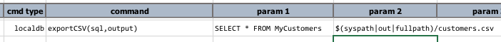
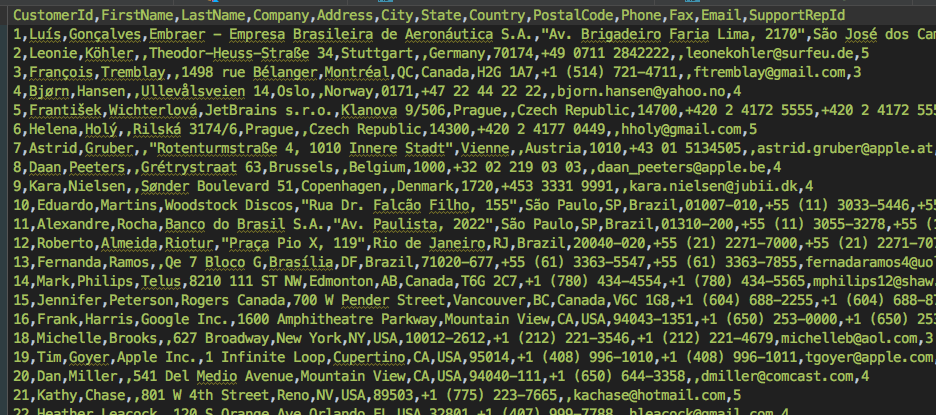
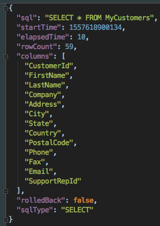

### Description
This command automates the export of a query (`sql`) result from `localdb` database into a CSV file (`output`). The 
behavior and outcome of this command is very similar to that of 
[RDBMS &raquo; `saveResult(db,sql,output)`](../rdbms/saveResult(db,sql,output)). In fact, Nexial internally reuse the
same code for both commands.

The CSV output (denote as `output`) will be comma-delimited, with newline (`\n`) as the record separator. In addition 
to saving query output to file, the metadata of the executed query is also saved to a JSON file corresponding to the 
specified `output`. See [RDBMS &raquo; `saveResult(db,sql,output)`](../rdbms/saveResult(db,sql,output)) for more 
details and examples.

### Parameters
- **sql** - the query to execute. Note that if this query does not result in any dataset (such as a UPDATE or 
  INSERT query), then only the result metadata file (JSON) will be generated.
- **output** - the target file to save the resulting dataset.

### Example
**Script**: 

**Output**: 

**The output metadata JSON**: 

### See Also
- [`cloneTable(var,source,target)`](cloneTable(var,source,target))
- [`dropTables(var,tables)`](dropTables(var,tables))
- [`importRecords(var,sourceDb,sql,table)`](importRecords(var,sourceDb,sql,table))
- [localdb commands](index#available-commands)