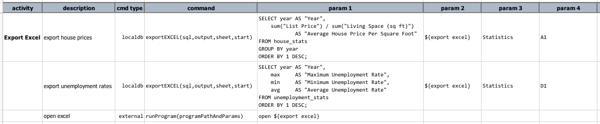
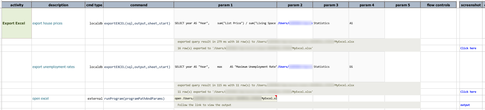
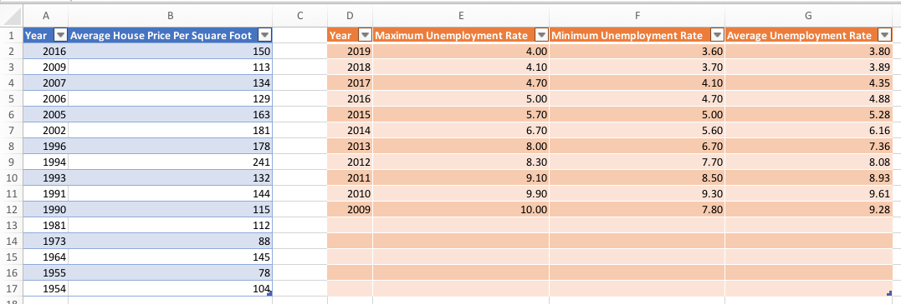

### Description
This command automates the export of a query (`sql`) result from `localdb` database into a Excel file (`output`). One 
may specify the target worksheet (`sheet`; default to `Sheet1`) and the starting cell address (`start`; default to `A1`)
for the export. The first row on the target worksheet will be the column names. If the specified Excel file or worksheet
does not exist, Nexial will attempt to create them.

This command is similar to [`exportCSV(sql,output)`](exportCSV(sql,output)). However, it is possible to export multiple
query results into the same Excel file or worksheet. One may use `start` to position multiple query results in the 
same worksheet. See [Example] section below for more details.

### Parameters
- **sql** - the query to execute. Note that if this query does not result in any dataset (such as a UPDATE or 
  INSERT query), then only the result metadata file (JSON) will be generated.
- **output** - the target Excel file to save the resulting dataset.
- **sheet** - the target Excel worksheet for export.
- **start** - the starting cell address (e.g. `A1` or `D94`) for the exported data.

### Example
The following script exports 2 separate queries into the same Excel worksheet.
**Script**: 

**Output**: 

**The target Excel, after some minor formatting**: 

### See Also
- [`cloneTable(var,source,target)`](cloneTable(var,source,target))
- [`dropTables(var,tables)`](dropTables(var,tables))
- [`importRecords(var,sourceDb,sql,table)`](importRecords(var,sourceDb,sql,table))
- [localdb commands](index#available-commands)