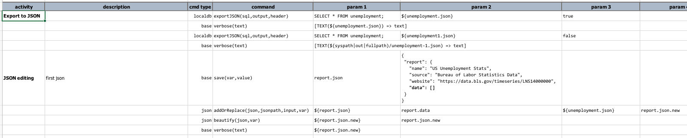
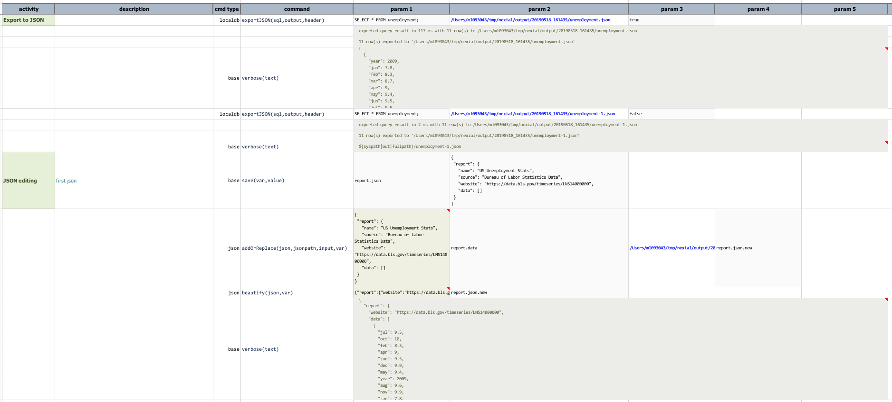
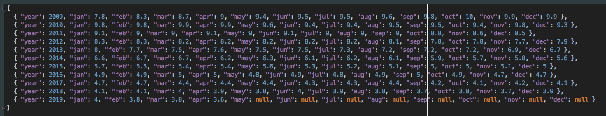
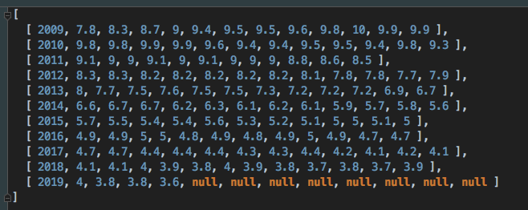

### Description
This command automates the export of a query (`sql`) result from `localdb` database into a JSON file (`output`). The
output format of such JSON can be varied via the value of `header`, which can be either `true` or `false`:

- `header` is `true`: this indicates that the export should include column name, which also determines the export format
  as "_array of object_", like so:
```json
  [
    { "column1": "data-of-row1-column1", "column2": "data-of-row1-column2", "column3": "data-of-row1-column3" },
    { "column1": "data-of-row2-column1", "column2": "data-of-row2-column2", "column3": "data-of-row2-column3" },
    { "column1": "data-of-row3-column1", "column2": "data-of-row3-column2", "column3": "data-of-row3-column3" },
    ... ...
  ]
```

- `header` is `false`: this indicates that the export should NOT include column name, thus determines the export 
  format as "_array of arrays_":
```json
  [
    [ "data-of-row1-column1", "data-of-row1-column2", "data-of-row1-column3" ],
    [ "data-of-row2-column1", "data-of-row2-column2", "data-of-row2-column3" ],
    [ "data-of-row3-column1", "data-of-row3-column2", "data-of-row3-column3" ],
    ... ...
  ]
```

A subtlety to note here is that, null/empty data will be exported to JSON regardless of how `header` is specified.

If the specified `output` file already exist, it will be overwritten. If not, Nexial will attempt to create all the 
necessary parent directories, if needed.


### Parameters
- **sql** - the query to execute. Note that if this query does not result in any dataset (such as a UPDATE or 
  INSERT query), then only the result metadata file (JSON) will be generated.
- **output** - the target file to export the resulting dataset.
- **header** - `true` or `false` to indicate whether the export data should include column names or not.


### Example
The example below export the same query result against localdb to multiple JSON file (one with header and one without). 
Then it "add" the first exported JSON (with header) to another JSON document.

**Script**:<br/>


**Output**:<br/>


**The first JSON (`${unemployment.json}`, with header)**:<br/>
Note the null records.<br/>


**The second JSON (`${unemployment1.json}`, without header)**:<br/>



### See Also
- [`cloneTable(var,source,target)`](cloneTable(var,source,target))
- [`dropTables(var,tables)`](dropTables(var,tables))
- [`importRecords(var,sourceDb,sql,table)`](importRecords(var,sourceDb,sql,table))
- [localdb commands](index#available-commands)