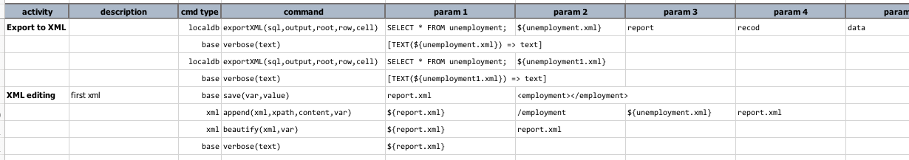
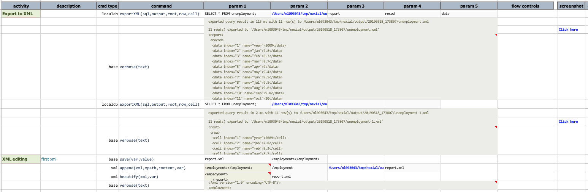
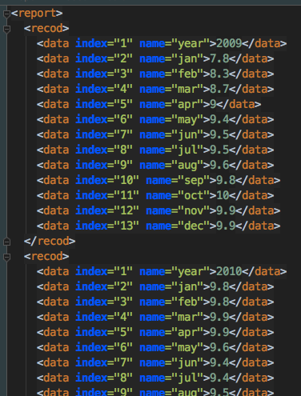
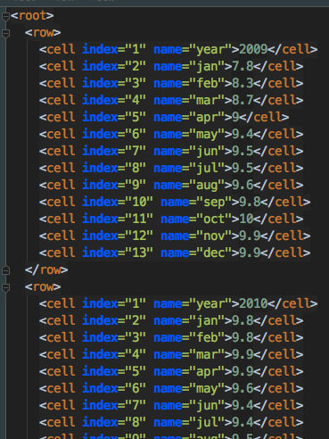

### Description
This command automates the export of a query (`sql`) result from `localdb` database into a XML file (`output`). The
structure of such XML is as follows:
```xml
<root>
  <row>
    <cell index="1" name="column-name">data-row1-cell1</cell>
    <cell index="2" name="column-name">data-row1-cell2</cell>
    <cell index="3" name="column-name">data-row1-cell3</cell>
  </row>
  <row>
    <cell index="1" name="column-name">data-row2-cell1</cell>
    <cell index="2" name="column-name">data-row2-cell2</cell>
    <cell index="3" name="column-name">data-row2-cell3</cell>
  </row>
  ... ...
</root>
```

One can change the node name of `root`, `row`, and `cell` via the 3rd, 4th and 5th parameters.

If the specified `output` file already exist, it will be overwritten. If not, Nexial will attempt to create all the 
necessary parent directories, if needed.


### Parameters
- **sql** - the query to execute. Note that if this query does not result in any dataset (such as a UPDATE or 
  INSERT query), then only the result metadata file (JSON) will be generated.
- **output** - the target XML file to save the resulting dataset.
- **root** - the XML node name for the "root" of the target XML document.
- **row** - the XML node name to represent each exported row to the target XML document.
- **cell** - the XML node name to represent each exported cell to the target XML document.


### Example
The example below export the same query result to 2 XML document, one with customized node names and the second with 
default node names.

**Script**:<br/>


**Output**:<br/>


**The output metadata JSON**:<br/>
The first one, with custom node names<br/>


The second with default node names<br/>



### See Also
- [`cloneTable(var,source,target)`](cloneTable(var,source,target))
- [`dropTables(var,tables)`](dropTables(var,tables))
- [`importRecords(var,sourceDb,sql,table)`](importRecords(var,sourceDb,sql,table))
- [localdb commands](index#available-commands)