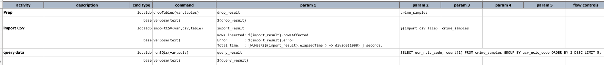
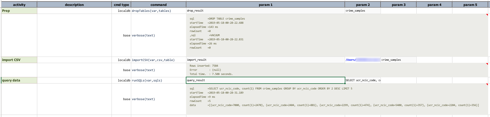

### Description
This command imports CSV data (`csv` may be a CSV file or data variable containing CSV records) to a `table` in the 
embedded database. If target `table` does not yet exist, Nexial will attempt to create it. However due to the dynamic 
data typing nature of SQLite, the autogenerated table might not be generated in the exact specification as one might 
expect. To ensure precision, it would be advisable to create the desired target `table` beforehand via 
[`runSQLs(var,sqls)`](runSQLs(var,sqls)). That said, it should be fairly safe to let Nexial generate the missing target
`table` for importing simple CSV data.

Note that this command WILL NOT remove any existing records from `table`.

### Parameters
- **var** - the data variable to store the outcome of import
- **csv** - the CSV data to import. This could either be a CSV file or data variable that holds CSV records
- **table** - the target table to import data

### Example
The example below imports CSV file into localdb table and then retrieved some of the imported data via SQL.
**Script**: 

**Output**: 

### See Also
- [`cloneTable(var,source,target)`](cloneTable(var,source,target))
- [`importEXCEL(var,excel,sheet,ranges,table)`](importEXCEL(var,excel,sheet,ranges,table))
- [`importRecords(var,sourceDb,sql,table)`](importRecords(var,sourceDb,sql,table))
- [localdb commands](index#available-commands)