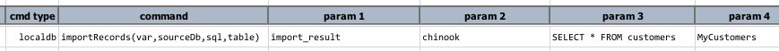
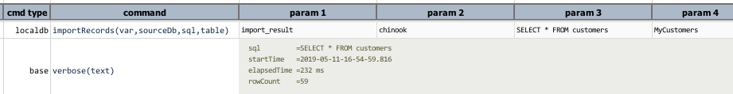

### Description
This command imports a query (`sql`) result of another database (`sourceDb`) into a `table` in the embedded database. 
If target `table` does not yet exist, Nexial will attempt to create it. However due to the dynamic data typing nature
of SQLite, the autogenerated table will likely not be exactly the same as the source table or the data types of the 
source query result. To ensure precision, it would be advisable to create the desired target `table` beforehand via
[`runSQLs(var,sqls)`](runSQLs(var,sqls)). That said, it should be fairly safe to let Nexial generate the missing target
`table` for importing simple query result.

### Parameters
- **var** - the data variable to store the outcome of import
- **sourceDb** - the source database connection
- **sql** - the query to run, and from which its result will be imported to the specified table
- **table** - the target table to import data

### Example
**Script**: 

**Output**: 

### See Also
- [localdb commands](index#available-commands)
- [`cloneTable(var,source,target)`](cloneTable(var,source,target))
- [`importCSV(var,csv,table)`](importCSV(var,csv,table))
- [`importEXCEL(var,excel,sheet,ranges,table)`](importEXCEL(var,excel,sheet,ranges,table))
