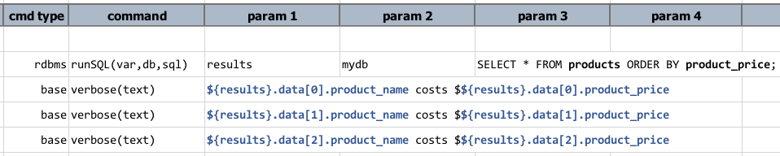
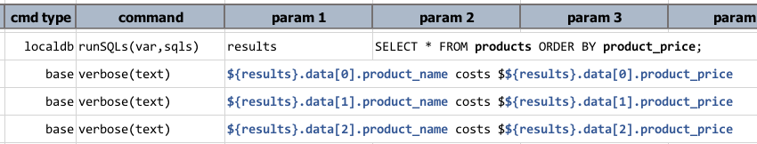

>Power of Relational Database embedded in Nexial!

## Introduction
What is _localdb_, you asked. Well, it's exactly what it sounds like - a local database!

More specifically, it is an embedded database, powered by the popular & awesome 
<a href="https://www.sqlite.org" class="external-link" target="_nexial_link">SQLite</a>, 
inside Nexial. One can manage and manipulate relational records directly via Nexial automation. As an embedded database,
the management overhead is nearly non-existence and its access is strictly localized (good for security). Embedded
database also means that there isn't any data throughput concern since there is no network impact. But one may ask, 
"_Why would I want an embedded database?_"

The impetus for `localdb` is mainly two-fold:
1. Support the collection and analysis of execution-bound data over time.
2. Support the manipulation and querying of complex or large-size structured data set.

## Support for Execution-Bound Data Set
Often we consider testing as a series of actions and validations, and test automation is no different. However there 
are cases where the validation tasks do not correspond strictly to the actions incurred during the same
execution. In other words, this is validation against the data collected through multiple executions. Much like a
time-series data problem, each execution should be viewed as another data point collection and analysis. There are a 
variety of use cases to use such data points as validations. For example,
- _Did the current test run as quickly as the last 30 tests?_
- _Did that API generate the same data as it did in the last release?_
- _Did this change in database configuration result in a 50% faster response time than previous 10 tests?_
- _Is there a pattern of FAIL steps across the same test scripts over the last month?_

To answer the above questions (and the alike) effectively, we need a way to track the pertinent data points over time. 
Similarly we need an efficient way to perform analysis. Here comes "localdb", the embedded database, to the rescue!

While it is entirely possible to take a more conventional approach such as using a RDBMS server (Oracle, DB2, SQL 
Server, PostgresSQL, etc.) or NoSQL server, there are a few good reasons to favor the embedded database instead:
1. Using database server means administrative and management overhead - DBA or additional IT personnel needed.
2. Using database server means network accessibility and throughput consideration. Yes, it is possible to run database 
   locally. But one would need to incur the administrative overhead as well as additional compute resource strain on 
   the test system.
3. Using database server might create, perhaps inadvertently, conflict and confusion. Imagine multiple testers using the
   same database and tables to manage data that are specific to different tests or test harness. One would need to take
   additional precautions to avoid such issue, and this might complicate the design of the associated test scripts.

With embedded database:
- There is barely any administrative overhead to speak of. In the case of SQLite, there is no need to create or maintain 
  users or roles since it is only locally accessible. There is no network consideration needed. And since data is not 
  remotely shared, one would have complete control and the confidence that the locally managed data will not impact or 
  be impacted by remote processes.

## Complex or Large-size Data Set
The other great thing about embedded database is the same as server-based database: **SQL**.
 
With SQL, one can manipulate and analyze large amount of complex data set. SQLite is ACID compliant and supports most of
the SQL standards. This makes the localdb commands a great approach towards manipulating and analyzing large data set, 
including multi-level hierarchical data.

SQL is also for ideal for data-driven validation. From testing perspective this is highly desirable, especially given 
the fact that most quality engineers and testers are well versed in SQL.

## Go Deeper
As an embedded database, Nexial has a predefined location for the "localdb" file. By design, this file is located at
`${user.home}/.nexial/localdb/nexial`, where `${user.home}` is the HOME directory of the automation user. In a shared 
environment, each user would have his/her own instance of the database file.

There is no need to initialize the database instance or perform any one-time set up. As soon as a 
<a href="https://en.wikipedia.org/wiki/Data_definition_language" class="external-link" target="_nexial_link">DDL</a> 
such as `CREATE TABLE` is executed, the appropriate database file will be created. Purging a database is also 
straightforward. Nexial provides a convenient command - [`purge(var)`](purge(var)) - which simply delete the localdb 
database file. Addition, Nexial provides commands to perform CRUD operations, data import/export to common structured 
data set such as JSON, XML, CSV, Excel.

Nexial provides functional parity with the query result between `localdb` commands and [`rdbms`](../rdbms) commands. 
This means that one can use the same techniques in `rdbms` commands as with `localdb` when dealing with resultset. 
For example, to retrieve the resultset from a [`rdbms.runSQL(var,db,sql)`](../rdbms/runSQL(var,db,sql)) command, one
could use the following syntax:

With `'localdb` commands, the syntax to retrieve data from a resultset is identical:

See [Working with Execution Result](../rdbms/index#working-with-execution-result) in [`rdbms`](../rdbms) page to 
understand what one can do with the query result.

In addition to utilizing Nexial, one can manage the localdb database via a myriad of commercial and free database tools 
that support SQLite (in alphabetical order):

#### Commercial Tools
- <a href="https://www.aquafold.com/aquadatastudio" class="external-link" target="_nexial_link">Aqua Data Studio for SQLite</a>
- <a href="http://www.dbtools.com.br/EN/" class="external-link" target="_nexial_link">DBTools</a> (trial version available)
- <a href="https://www.jetbrains.com/datagrip/features/" class="external-link" target="_nexial_link">JetBrains DataGrip</a>
- <a href="https://www.navicat.com/en/products/navicat-for-sqlite" class="external-link" target="_nexial_link">Navicat for SQLite</a> (trial version available)
- <a href="https://www.razorsql.com/landing/sqlite_gui.html" class="external-link" target="_nexial_link">RazorSQL SQLite GUI</a>
- <a href="https://www.sqlabs.com/sqlitemanager.php" class="external-link" target="_nexial_link">SQLiteManager</a>
- <a href="http://www.logicalvue.com/sqlvue/" class="external-link" target="_nexial_link">SQLVue</a>

#### Free/Open Source Tools
- <a href="https://dbeaver.io/" class="external-link" target="_nexial_link">DBeaver, Community</a> (enterprise edition available)
- <a href="https://www.dbvis.com/" class="external-link" target="_nexial_link">DbVisualizer, Basic</a> (pro version available)
- <a href="https://sqlitebrowser.org/" class="external-link" target="_nexial_link">DB Browser for SQLite</a>
- <a href="http://www.sqliteexpert.com/" class="external-link" target="_nexial_link">SQLiteExpert</a> (pro version available)
- <a href="https://sqlitestudio.pl/" class="external-link" target="_nexial_link">SQLite Studio</a>
- <a href="https://addons.mozilla.org/en-US/firefox/addon/sqlite-manager-webext/" class="external-link" target="_nexial_link">SQLite Manager, a Firefox Add-On</a>
- <a href="https://tableplus.io/" class="external-link" target="_nexial_link">TablePlus</a> (commercial license available)
- <a href="https://sqliteonline.com/" class="external-link" target="_nexial_link">SQLite Online (browser-based)</a>

## SQLite References
Here are some useful links and references about SQLite: 

- <a href="https://en.wikipedia.org/wiki/SQLite" class="external-link" target="_nexial_link">SQLite on Wikipedia</a>
- <a href="https://www.sqlite.org/lang.html" class="external-link" target="_nexial_link">SQL as understood by SQLite</a>
- <a href="https://www.sqlite.org/lang_corefunc.html" class="external-link" target="_nexial_link">SQLite Core Functions</a>
- <a href="https://www.sqlite.org/lang_aggfunc.html" class="external-link" target="_nexial_link">SQLite Aggregate Functions</a>
- <a href="https://www.sqlite.org/lang_datefunc.html" class="external-link" target="_nexial_link">SQLite Date and Time Functions</a>
- <a href="https://www.sqlite.org/fts5.html" class="external-link" target="_nexial_link">SQLite FTS5 (full-text search) extension</a>
- <a href="https://sqlite.org/omitted.html" class="external-link" target="_nexial_link">SQL Features That SQLite Does Not Implement</a>
- <a href="http://www.sqlitetutorial.net/" class="external-link" target="_nexial_link">SQLite Tutorial by sqlitetutorial.net</a>
- <a href="https://www.quackit.com/sqlite/tutorial/" class="external-link" target="_nexial_link">SQLite Tutorial by QuackIt</a>

## Available Commands
- [`cloneTable(var,source,target)`](cloneTable(var,source,target))
- [`dropTables(var,tables)`](dropTables(var,tables))
- [`exportCSV(sql,output)`](exportCSV(sql,output))
- [`exportEXCEL(sql,output,sheet,start)`](exportEXCEL(sql,output,sheet,start))
- [`exportJSON(sql,output,header)`](exportJSON(sql,output,header))
- [`exportXML(sql,output,root,row,cell)`](exportXML(sql,output,root,row,cell))
- [`importCSV(var,csv,table)`](importCSV(var,csv,table))
- [`importEXCEL(var,excel,sheet,ranges,table)`](importEXCEL(var,excel,sheet,ranges,table))
- [`importRecords(var,sourceDb,sql,table)`](importRecords(var,sourceDb,sql,table))
- [`purge(var)`](purge(var))
- [`runSQLs(var,sqls)`](runSQLs(var,sqls))
