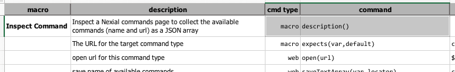
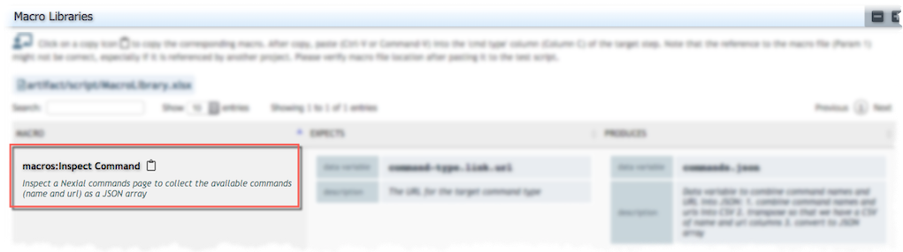

### Description
This command is essentially a "no-op" command, which performs no automation during execution. This is a "marker"
command from which Nexial can gather the corresponding "description" of this command as the usage documentation of this
macro. Combined with the use of [`nexial-project-inspector`](../../userguide/BatchFiles#nexial-project-inspector)
batch, Nexial can generate helpful documentation for better teamwork and script (macro) reuse.

Check out [Using `nexial-project-inspector`](index#using-nexial-project-inspector) for more details.

### Parameters
- none

### Example
 
This command takes no parameter and performs no automation. But during the execution of 
[`nexial-project-inspector`](../../userguide/BatchFiles#nexial-project-inspector), the 
corresponding "description" will be collected to generate macro documentation, as depicted below: 

### See Also
- [macro &raquo; `description()`](description()) 
- [macro &raquo; `expects(var,default)`](expects(var,default))
- [macro &raquo; `produces(var,value)`](produces(var,value)) 
