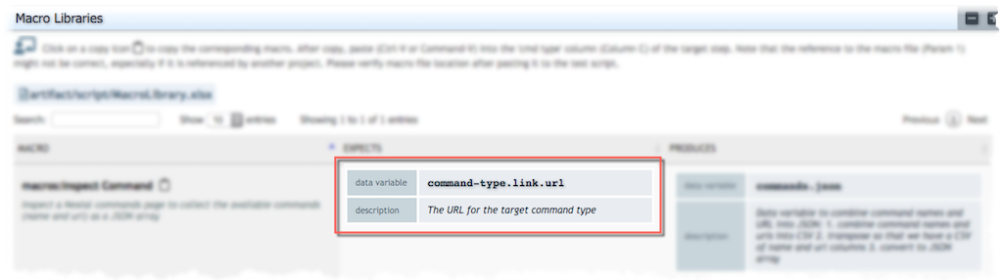

### Description
This command serves 2 purposes:
1. Performs execution-time assertion that the specified data variable (`var`) is defined. 
   At the time of execution, if the specified data variable is not defined but a `default` value is, then the 
   specified data variable will be created with the specified `default` value. However, no `default` value is given and 
   the specified data variable is not present, Nexial will issued a FAIL result for this command. The latter scenario 
   is functionally equivalent to [base &raquo; `assertVarPresent(var)`](../base/assertVarPresent(var)).
2. As a "marker" for
   [`nexial-project-inspector`](../../userguide/BatchFiles#nexial-project-inspector) to 
   collect the "expectation" of this macro prior to its invocation.

### Parameters
- **var** - the data variable this macro expects to be defined prior to its invocation.
- **default** - the default value to use if the expected data variable is not defined.

### Example
 
The above use of the `expects` command shows one data variable - `command-type.link.url` - is expected by the enclosing
macro. Since no default is defined, Nexial will issue a FAIL result if the specified data variable is not defined at
the time of execution. Consequently, the execution of 
[`nexial-project-inspector`](../../userguide/BatchFiles#nexial-project-inspector) would
result the expected data variable and the corresponding description being added to the generated macro documentation, 
as depicted below: 
 

### See Also
- [macro &raquo; `description()`](description()) 
- [macro &raquo; `produces(var,value)`](produces(var,value)) 
- [base &raquo; `assertVarPresent(var)`](../base/assertVarPresent(var))