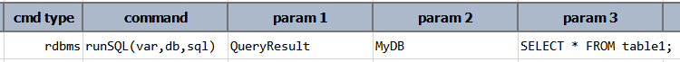
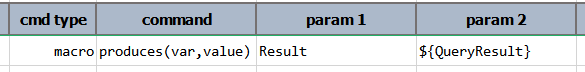
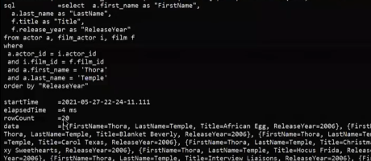
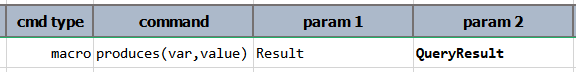

### Description
This command has 2 purposes:
1. Set the specified data variable (`var`) with specified value (`value`) - functionally equivalent to 
   [base &raquo; `save(var,value)`](../base/save(var,value)).
2. As a "marker" for
   [`nexial-project-inspector`](../../userguide/BatchFiles#nexial-project-inspector) to 
   collect what this macro will produce by the end of its invocation.

Using this command, one can "expose" data to the calling script so that such data can be used to further the automation.

It is possible to specify a data variable as the `value`, rather than the data variable's value. For example, suppose 
that a macro contains the execution of a query using [rdbms &raquo; `runSQL(var,db,sql)`](../rdbms/runSQL(var,db,sql)):

Reference the value of `QueryResult` - meaning `${QueryResult}` - would expose the value of `QueryResult`. In the 
following example, the value of `QueryResult` is exposed as `Result` data variable:

As such, one would expect the value of `Result` to be something like this:

In contrast, one could expose the data variable `QueryResult` by another name. Such is the case where a data variable
would be exposed (from macro to the calling script) by an alias - in other words, by another data variable name. For 
example,

The above shows that the data variable `QueryResult` is exposed as another data variable by the name of `Result`. From
the calling script, one would be able to use `Result` as an 
[execution result](../rdbms/executionResult), such as `${Result}.data`, `${Result}.rowCount`, `${Result}.error`, etc.

Generally speaking, it's a good idea to expose data variable as is when dealing with complex structure as such
query result or [API response](../ws/index#http-response). For simple data type such as text or number, one can expose 
the value of target data variable via the `${...}` notation. 

### Parameters
- **var** - the data variable to be created or overwritten at the time of this command's execution. Functionally 
  equivalent to [base &raquo; `save(var,value)`](../base/save(var,value)).
- **value** - the value to assign to the specified data variable, or the data variable itself (without the 
  `${...}` notation).

### Example
 
The above use of the `produces` command shows that one data variable - `commands.json` - will either be created or 
overwritten with whatever value assigned to the `value` column. After 
[`nexial-project-inspector`](../../userguide/BatchFiles#nexial-project-inspector) is 
executed, the specified data variable and the corresponding description will be added to the generated macro 
documentation, as depicted below: 

### See Also
- [macro &raquo; `description()`](description()) 
- [macro &raquo; `expects(var,default)`](expects(var,default))
- [base &raquo; `save(var,value)`](../base/save(var,value))
