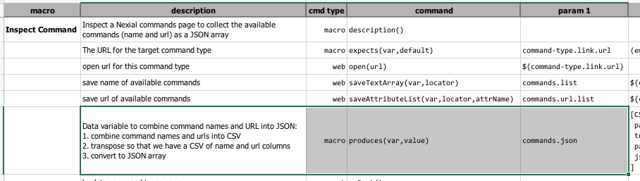
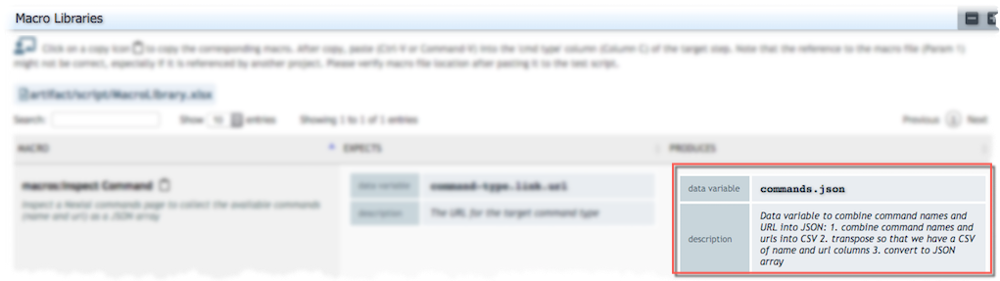

### Description
This command has 2 purposes:
1. Set the specified data variable (`var`) with specified value (`value`) - functionally equivalent to 
   [base &raquo; `save(var,value)`](../base/save(var,value)).
2. As a "marker" for
   [`nexial-project-inspector`](../../userguide/BatchFiles#nexial-project-inspector) to 
   collect what this macro will produce by the end of its invocation.

### Parameters
- **var** - the data variable to be created or overwritten at the time of this command's execution. Functionally 
  equivalent to [base &raquo; `save(var,value)`](../base/save(var,value)).
- **value** - the value to assign to the specified data variable.

### Example
 
The above use of the `produces` command shows that one data variable - `commands.json` - will either be created or 
overwritten with whatever value assigned to the `value` column. After 
[`nexial-project-inspector`](../../userguide/BatchFiles#nexial-project-inspector) is 
executed, the specified data variable and the corresponding description will be added to the generated macro 
documentation, as depicted below: 

### See Also
- [macro &raquo; `description()`](description()) 
- [macro &raquo; `expects(var,default)`](expects(var,default))
- [base &raquo; `save(var,value)`](../base/save(var,value))
