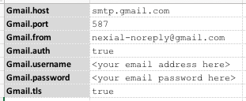
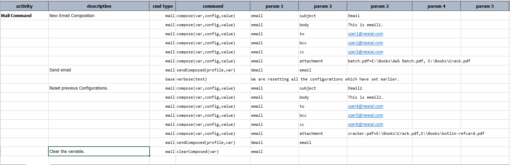
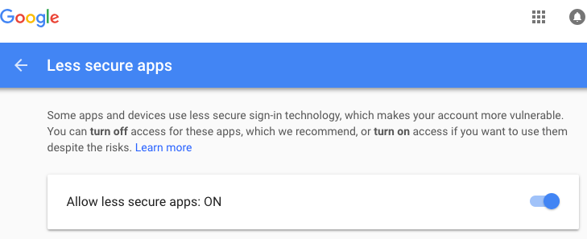

The "mail" command type represents the automation command regarding sending emails.  Future enhancement could include
the retrieval of emails as well (_if you need this feature sooner, submit an 
<a href="https://github.com/nexiality/nexial-core/issues/new" class="external-link" target="_nexial_external">issue</a> 
to increase the priority thereof_).

In order to send email, appropriate mail server connectivity must be defined first.  The section below describes how
mail server connectivity would be configured. 

It is noteworthy to clarify that the mail server connectivity used here may not necessarily be the same as that used
by Nexial to [send out email notification](../../systemvars/index#nexial.enableEmail).

### Mail Settings
The `mail` command type uses a "profile" to group related data variables together, much like the case for 
[`ssh`](../ssh/index#connection-setup), [`rdbms`](../rdbms/index#database-connection-setup) or 
[`aws.s3`](../aws.s3/index#connection-setup).  The profile-based connectivity setting can be defined via command line 
(i.e. `-D`), [`project.properties`](../../userguide/UnderstandingProjectStructure#project.properties), or the 
appropriate data file.  For example, via command line:

> set JAVA_OPT=-DMyMail.from=boss@mystore.com -DMyMail.host=mail.mystore.com -DMyMail.port=25
> 
> nexial.sh -plan ... ...

Here are the various settings available to configure the appropriate mail server for your automation 
(assuming profile is `MyEmail`):

| data variable         | description                                                                    |
| --------------------- | ------------------------------------------------------------------------------ |
| `MyEmail.host`        | **[REQUIRED]** the SMTP host for nexial                                        |
| `MyEmail.port`        | **[REQUIRED]** the SMTP port for nexial; default is `25`                       |
| `MyEmail.username`    | [optional] auth user for SMTP host. Required only if `auth` is true            |
| `MyEmail.password`    | [optional] auth credential for SMTP host. Required only if `auth` is true      |
| `MyEmail.tls`         | [optional] boolean; determine if TTLS is enable for SMTP                       |
| `MyEmail.localhost`   | [optional] determine if SMTP service is locally available                      |
| `MyEmail.from`        | **[REQUIRED]** the sender of mail sent via nexial                              |
| `MyEmail.protocol`    | **[REQUIRED]** `smtp` or `imap`; default is `smtp`                             |
| `MyEmail.auth`        | [optional] whether authentication is required to send mail; default is `false` |
| `MyEmail.bufferSize`  | [optional] buffer size for smtp packet; default to system default of `512`     |
| `MyEmail.contentType` | [optional] smtp MIME type to use; default is `text/html`                       |

 

#### Gmail
Sending email via Gmail is possible, albeit a few things to take care initially.

Here's the settings for targeting Gmail as the mail host: 

Note that you need to fill in the correct email and password for `Gmail.username` and `Gmail.password`. You can 
optionally rename the profile from `Gmail` to something else.

Gmail by default enforces "secured third-party client app" such that programmatically access (such as Nexial does) is 
denied.  You might see a similar error as below when running a `mail` command against Gmail: 

This is an indication that the email account in questionis restricted to "secured third-party client app" only. For 
further understanding about this, please visit 
<a href="https://support.google.com/mail/answer/7126229?visit_id=1-636610148744612821-503885497&rd=2#cantsignin" class="external-link" target="nexial_link">https://support.google.com/mail/answer/7126229?visit_id=1-636610148744612821-503885497&rd=2#cantsignin</a>
and <a href="https://support.google.com/accounts/answer/6010255" class="external-link" target="nexial_link">https://support.google.com/accounts/answer/6010255</a>.

This issue can be addressed via 
<a href="https://myaccount.google.com/lesssecureapps" class="external-link" target="nexial_link">https://myaccount.google.com/lesssecureapps</a>. 
After successfully signing in to your Gmail account, proceed to enable "les secure apps" option:

After this, you should be able to send email via your Gmail account.  For security reason, it is recommended **NOT**
to use your personal account for automation.  Instead, set up another Gmail account for the purpose of automating
the sending of emails via Nexial.

### Available Commands
- [`send(profile,to,subject,body)`](send(profile,to,subject,body))

