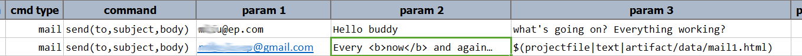

### Description
This command instructs Nexial to send out an email to one or more email recipients (all as "To") with the same 
subject line and same email body. The email body will default to **text/html**. This means that email body can 
be HTML. 

Read about [Mail Settings](index#mail-settings) for details about configuring mail server for your automation.

### Parameters
- **profile** - the profile of the target mail connectivty. See [mail settings](index#mail-settings) for more details.
- **to** - one or more email recipients, separated by comma. Example: `john_doe@company1.com,jane_smith@company2.com`
- **subject** - the email subject line. All recipients will receive the same email subject line
- **body** - the email body which all recipients will receive. The content is assumed as plain text. Also, it is 
  possible to use the **[`$(projectfile)`](../../functions/$(projectfile))** built-in variable to pull in email 
  content from a file. Token replacement will be in effect.

### Example
**Script**: 

### See Also
- [`$(projectfile)`](../../functions/$(projectfile))
- [aws.ses &raquo; `sendTextMail(profile,to,subject,body)`](../aws.ses/sendTextMail(profile,to,subject,body))
- [aws.ses &raquo; `sendHtmlMail(profile,to,subject,body)`](../aws.ses/sendHtmlMail(profile,to,subject,body))
