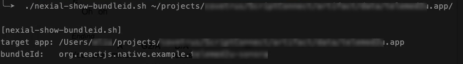

To determine the `bundleId` for iOS apps, one can use Nexial's `show-ios-bundleid.sh` script, like this:

```
cd $NEXIAL_HOME
cd bin/mobile
./show-ios-bundleid.sh [location of .app file]
```

Here's an example output:


Note that since iOS automation is only supported on MacOS (requires Xcode), this script will work only on MacOS as well. 
