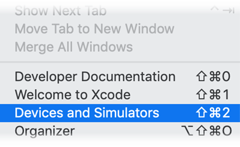
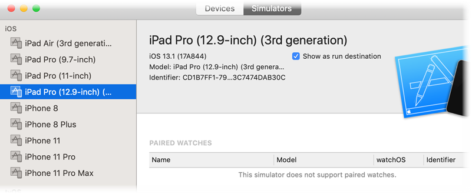

To find the UDID of the connected device or simulator, here are a few ways:

1. To find the UDID of connected device:
   ```
   idevice_id –list
   ```
2. To find the UDID of running simulator:
   ```
   xcrun simctl list | grep Booted
   ```
   &nbsp;&nbsp;&nbsp;&nbsp;
3. Use XCode to find the UDID (Identifier) of connected devices and simulators:<br/>
   &nbsp;&nbsp;&nbsp;&nbsp;<b>Xcode -> Window -> Devices and Simulators</b> -> Select Device<br/>
   &nbsp;&nbsp;&nbsp;&nbsp;<br/>
   &nbsp;&nbsp;&nbsp;&nbsp;
