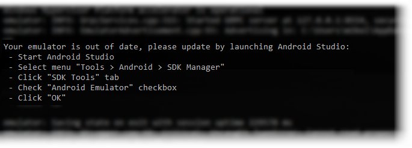

### Introduction
Nexial comes with a few batch files to simplify the initial environment set up for mobile testing. In the case of 
Android mobile testing, the following software must be installed:
- Android SDK
- One or more Android system images
- One or more Android emulators

The `android-setup` batch file is created to simplify these installations. This batch file can be found under 
`$NEXIAL_HOME\bin\mobile\android-setup.cmd` (Windows) or `$NEXIAL_HOME/bin/mobile/android-setup.sh` (MacOS). Using this
batch file, the above-mentioned software will be installed in predefined directory structure to expedite mobile testing
with Nexial.


### Usage

1. Open command console or terminal.
2. Navigate to the `bin/mobile` directory under `$NEXIAL_HOME`.
3. Executing this batch file without any option would render a basic help screen indicating the missing parameters.
   
4. Run `android-setup.cmd` (Windows) or `./android-setup.sh` by specifying your target project.<br/>

   | System  | Example                                      |
   |+-------+|+---------------------------------------------|
   | Windows | `android-setup.cmd -t C:\projects\MyProject` |
   | MacOS   | `./android-setup.sh -t ~/projects/MyProject` |
   |+-------+|+---------------------------------------------|

   <br/>Optionally `-v` for log verbosity, like this:<br/>
   ```
	 android-setup.cmd -v -t C:\projects\MyProject
	 ```

Below shows the various stages of the installation process.


#### Stage 1 - Confirming installation override
The `android-setup` batch file will install Android SDK and all related files under `<HOME>/.nexial/android/sdk`, the
Android emulators will be installed under `<HOME>/.android/avd`.

If you had previously installed Android SDK, you will be asked to confirm if you want to override existing installation.
<br/>


#### Stage 2 - Installing Android SDK CommandLine Tool
The `android-setup` batch file will download the commandline tool from the Internet and install it locally.<br/>


#### Stage 3 - Installing pre-accepted license agreements
As part of Android SDK installation, you will be asked to accept a series of license agreements. In order to expedite
the installation process and to support "silent installation", the `android-setup` batch file will "pre-accept" these
license agreements on your behalf.<br/>


#### Stage 4 - Installing pre-packaged Android emulator skins
Nexial is prepackaged with a set of "skins" for a more realistic look and feel on the Android emulators. From time to
time, we will update these "skins" with additional ones.<br/>


#### Stage 5 - Installing required Android SDK components
Next, the required Android SDK components are downloaded and installed locally.<br/>


#### Stage 6 - Installing Android SDK system images
In order to run an Android emulator, at least 1 system image must be installed locally. Copy the name of one of the
listed system images...<br/>


... paste it to the end of the prompt, and press `<ENTER>`:<br/>


Repeat this process for as many system images you wish to install. Enter `QUIT` to end this stage.

#### Stage 7 - Setting up apksigner


#### Stage 8 - Installing Android emulator
Copy one of the listed emulator IDs... <br/>


... paste it to the end of the prompt, and press `<ENTER>`. Then, specify one of the installed system images for this
emulator:<br/>


Repeat this stage to install more emulators. When done, enter `QUIT` to end this stage.<br/>


### Setting environment variables
By default, Nexial assumes that Android SDK is installed under `<HOME>/.nexial/android/sdk`. If you have installed the
Android SDK in a different location, please set up the following environment variables:

```
ANDROID_HOME=<the location of Android SDK>
ANDROID_SDK_ROOT=<the location of Android SDK>
```


### Running Emulator
Based on the installation process (Stage 8, above), you may have 1 or more batch files (or shell scripts) created
under the `artifact/bin` directory under your project. Each of these batch files are prefixed with 
`run-android-emulator-`. Simply double-click on one of these batch files, or run it from the console, will start
the emulator. Note that the initial launch of an emulator might take a little longer.

Example (on Windows):
```
cd /d C:\projects\MyProject
cd artifact\bin
run-android-emulator-Galaxy_S21.cmd
```

Example (on MacOS):
```
cd ~/projects/MyProject
cd artifact/bin
./run-android-emulator-Galaxy_S21.sh
```


### Updating Android SDK
From time to time, the Android SDK is updated by the Google Android development team. As a result, your Android SDK
might become outdated after some time. If you see a similar message on your console after launching an emulator:



... then, it's time to update your Android SDK.

On **Window**:
```
cd %NEXIAL_HOME%\bin\mobile
update-android-sdk.cmd
```

On **Linux/MacOS**:
```
cd $NEXIAL_HOME/bin/mobile
./update-android-sdk.sh
```

This script will update the installed Android SDK, which will in turn update the OS image file for your emulators. Be
sure that all emulators are terminated before running the `update-android-sdk` script.

