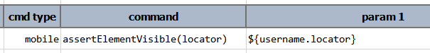

### Description
This command asserts the value of the specified `attribute` from the first element that matches the specified `locator`.
This attribute value is matched against `text` (PolyMatcher supported here). Note that only the first matching locator 
is considered in this case. 

It is noteworthy to know the following:
- If no element matches the `locator` but `text` is empty (i.e. `(empty)`), then this command considered as a PASS.
- If the first matching element does not contain the `attribute` and `text` is empty (i.e. `(empty)`), then this 
  command considered as a PASS.
- If either no matching element is found of the first matching element does not contain `attribute` BUT the `text` is 
  not specified as `(empty)`, then the corresponding step would result in a FAIL.






### Parameters
- **locator** - the locator of the element in question.

### Example

### See Also
- [`assertElementNotVisible(locator)`](assertElementNotVisible(locator))
- [`assertElementPresent(locator)`](assertElementPresent(locator))
- [`assertElementsPresent(prefix)`](assertElementsPresent(prefix))
- [`assertTextPresent(locator,text)`](assertTextPresent(locator,text))
- [`saveText(var,locator)`](saveText(var,locator))
- [`saveTextArray(var,locator)`](saveTextArray(var,locator))
- [`waitForElementPresent(locator,waitMs)`](waitForElementPresent(locator,waitMs))
