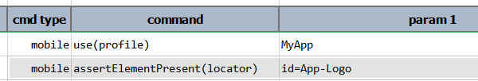

### Description
This command asserts that at least 1 element on the current application screen matches the specified `locator`. If no
element matches the specified `locator` after some time (see below), then the corresponding step is deemed as **FAIL**.




### Parameters
- **locator** - the locator of the element in question. 

### Example

### See Also
- [`assertElementVisible(locator)`](assertElementVisible(locator))
- [`assertElementsPresent(prefix)`](assertElementsPresent(prefix))
- [`assertTextPresent(locator,text)`](assertTextPresent(locator,text))
- [`saveText(var,locator)`](saveText(var,locator))
- [`saveTextArray(var,locator)`](saveTextArray(var,locator))
- [`waitForElementPresent(locator,waitMs)`](waitForElementPresent(locator,waitMs))
