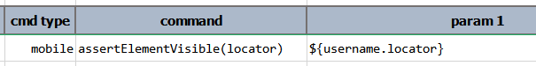

### Description
This command asserts that at least 1 element on the current application screen matches the specified `locator` and is
visible. The visibility is determined via such element's `displayed` attribute. If an element that matches the specified
`locator` and its `displayed` attribute is set to `true` is found, then the corresponding step is considered as PASS.
Otherwise, it is considered as FAIL.




### Parameters
- **locator** - the locator of the element in question.

### Example

### See Also
- [`assertElementPresent(locator)`](assertElementPresent(locator))
- [`assertElementsPresent(prefix)`](assertElementsPresent(prefix))
- [`assertTextPresent(locator,text)`](assertTextPresent(locator,text))
- [`saveText(var,locator)`](saveText(var,locator))
- [`saveTextArray(var,locator)`](saveTextArray(var,locator))
- [`waitForElementPresent(locator,waitMs)`](waitForElementPresent(locator,waitMs))
