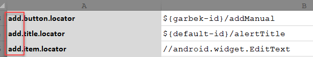
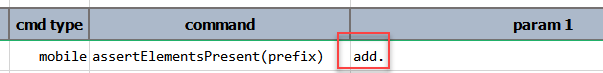

### Description
This command instructs Nexial to harvest a set of data variables that match to the form of `[prefix]...locator` and
use the value of such data variables as locators to assert the presence of elements on the current application screen. 
The `[prefix]` will be specified via the first parameter. Such data variables **must** end with `.locator`. The 
corresponding data variables can contain any of the [supported locators](index#locators).

Note that this command will attempt to assert all locators regardless of the presence of each targeted element. It
will FAIL if one or more target elements ia not found. In other words, it will only PASS if all elements as indicated 
by the gathered locators are found.

If [`nexial.verbose`](../../systemvars/index#nexial.verbose) is set to `true`, Nexial would output additional 
validation output. But a `false` (default) value will result in error-only output in the execution result.




### Parameters
- **prefix** - the prefix to gather a set of data variables that contain locator for "element presence" test.

### Example
Consider the following data sheet contains 3 data variables prefixed with `add.`:

We can validate all 3 locators via this single command: 

### See Also
- [`assertElementPresent(locator)`](assertElementPresent(locator))
- [`assertElementVisible(locator)`](assertElementVisible(locator))
- [`assertTextPresent(locator,text)`](assertTextPresent(locator,text))
- [`saveText(var,locator)`](saveText(var,locator))
- [`saveTextArray(var,locator)`](saveTextArray(var,locator))
- [`waitForElementPresent(locator,waitMs)`](waitForElementPresent(locator,waitMs))
